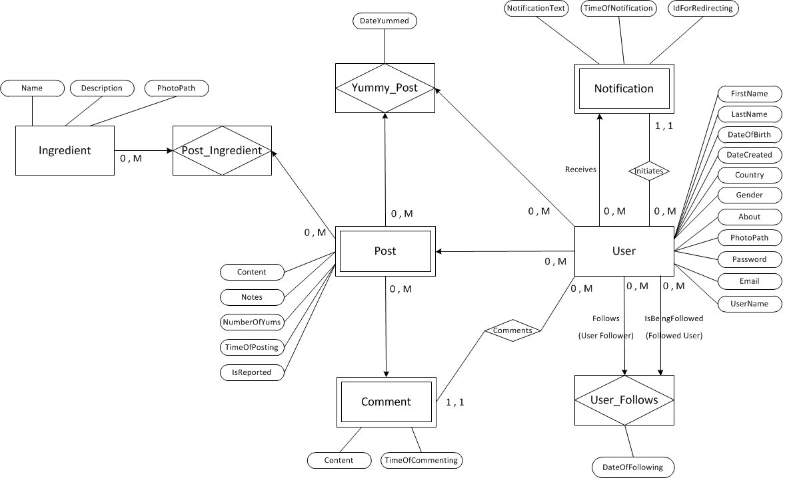

# YumApp  
Social network for chefs all over the world.  
Share your favourite meals with others.  
  
  
## Entity–relationship model
  
  
    
## Relational model
AppUser(<ins>Id</ins>, FirstName, LastName, DateOfBirth, DateCreated, Country, Gender, About, PhotoPath, Password, Email, UserName)  
User_Follows(<ins>FollowerId, FollowsId</ins>, DateOfFollowing)  
Notification(<ins>ReceiverId, Id</ins>, NotificationText, TimeOfNotification, IdForRedirecting, InitiatorId)  
Post(<ins>AppUserId, Id</ins>, Content, Notes, NumberOfYums, TimeOfPosting, IsReported)  
Yummy_Post(<ins>AppUserId, PostAppUserId, PostId</ins>, DateYummed)  
Comment(<ins>AppUserId, PostId</ins>, Content, TimeOfCommenting, CommentatorId)  
Ingredient(<ins>Id</ins>, Name, Description, PhotoPath)  
Post_Ingredient(<ins>AppUserId, PostId, IngredientId</ins>)  
  
## Technologies  
C#, ASP.NET Core MVC, Entity Framework Core, MS SQL Server, HTML5, CSS3, Bootstrap, JavaScript, jQuery, SignalR
